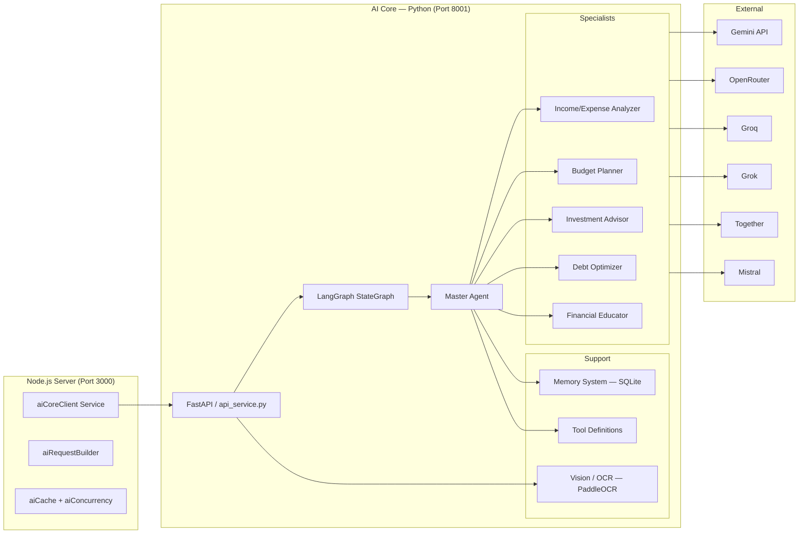

# FinWise — AI Core (Agent System)

> Documentation for the Python-based multi-agent financial intelligence engine.

---

## Overview

The **AI Core** lives in `server/AI_Core/` and provides the intelligent reasoning layer for FinWise. It uses **LangGraph** to orchestrate a directed graph of specialist agents, powered by multiple LLM providers with automatic failover.

The Node.js server communicates with AI Core via HTTP through the `aiCoreClient` service (`server/src/services/aiCoreClient.ts`).

## Recent Runtime Upgrades

Recent platform work expanded the AI Core into a more resilient long-running system:

- multi-key provider pools, including multiple OpenRouter keys
- external capability-based model catalog with 100+ managed entries
- per-key and per-model health scoring with cooldowns and circuit breaking
- resumable sessions with checkpoints, compact memory, and workflow phase recovery
- richer route metadata for active provider, active model, fallback path, and recovered failures
- deterministic financial fallback when every LLM path fails

The main implementation lives in:

- `utils/key_pool.py`
- `utils/model_catalog.py`
- `utils/model_health.py`
- `utils/session_manager.py`
- `utils/llm_wrapper.py`
- `graph/workflow.py`

---

## Architecture



---

## Directory Structure

```
AI_Core/
├── agents/
│   ├── __init__.py
│   ├── master_agent.py              # Orchestrator — routes to specialists, synthesizes responses
│   ├── income_expense_analyzer.py   # Analyzes income, expenses, trends, savings rates
│   ├── budget_planner.py            # Creates and optimizes budgets (50/30/20, zero-based)
│   ├── investment_advisor.py        # Portfolio recommendations, risk analysis
│   ├── debt_optimizer.py            # Debt repayment strategies (avalanche vs snowball)
│   └── financial_educator.py        # Explains financial concepts, mini-lessons
├── graph/
│   ├── state.py                     # AgentState TypedDict, AnalysisType enum, Pydantic models
│   └── workflow.py                  # LangGraph StateGraph with conditional routing
├── tools/
│   ├── plan_builder.py              # Builds structured financial plans from analysis
│   ├── financial_calculators.py     # Financial math utilities (NPV, IRR, amortization)
│   └── data_processors.py           # Data processing utilities
├── memory/
│   ├── store.py                     # Persistent memory store (SQLite)
│   ├── extract.py                   # Memory extraction from conversations
│   └── __init__.py
├── vision/
│   ├── engine.py                    # OCR engine (PaddleOCR)
│   ├── receipt_parser.py            # Receipt field extraction (vendor, amount, date, items)
│   ├── handwriting_parser.py        # Handwriting recognition
│   ├── preprocess.py                # Image preprocessing
│   └── errors.py                    # Vision-specific error types
├── contracts/
│   ├── responses.py                 # Pydantic response models
│   ├── plan.py                      # Financial plan models
│   ├── trace.py                     # Workflow trace models
│   └── tool_calls.py                # Tool call validation models
├── utils/
│   ├── llm_wrapper.py               # Task-aware routing, key/model/provider failover
│   ├── provider_registry.py         # Provider configs and client adapters
│   ├── key_pool.py                  # Multi-key rotation, cooldown, circuit breaking
│   ├── model_catalog.py             # External model catalog loader and ranking
│   ├── model_health.py              # Per-model latency/error health scoring
│   ├── session_manager.py           # Resumable sessions and checkpoints
│   ├── helpers.py                   # General utilities
│   ├── rate_limiter.py              # Request-level rate limiting and retry wrapper
│   ├── request_metrics.py           # Request metrics and token usage
│   ├── prometheus_metrics.py        # Prometheus metrics
│   └── finwise_server.py            # Server communication utilities
├── tests/                           # 15 pytest test files
├── api_service.py                   # FastAPI HTTP server (1372 lines)
├── main.py                          # CLI entry point for standalone use
├── requirements.txt                 # 24 Python dependencies
└── pyproject.toml                   # Project metadata
```

---

## Agent Descriptions

### Master Agent (`master_agent.py`)

The orchestrator. It:

1. Receives a user query + optional financial profile
2. Classifies the query type using **deterministic keyword-based analysis type detection** (no LLM call for routing)
3. Delegates to the most appropriate specialist agent(s)
4. Aggregates and formats the final response with action items and workflow trace
5. Builds tool calls for actionable recommendations

### Income/Expense Analyzer (`income_expense_analyzer.py`)

- Analyzes transaction patterns and spending trends
- Identifies anomalies and unusual spending
- Calculates savings rates and cash flow projections
- Categorizes income sources and expense patterns

### Budget Planner (`budget_planner.py`)

- Creates category-level budget allocations
- Supports multiple budgeting methodologies:
  - 50/30/20 rule (needs/wants/savings)
  - Zero-based budgeting
- Suggests optimizations based on spending history
- Tracks allocated vs. actual spending

### Investment Advisor (`investment_advisor.py`)

- Recommends portfolio allocations based on risk tolerance
- Analyzes existing investment mix
- Suggests rebalancing strategies
- Considers time horizon and investment experience level

### Debt Optimizer (`debt_optimizer.py`)

- Compares debt repayment strategies:
  - **Avalanche** — highest interest rate first (saves most money)
  - **Snowball** — smallest balance first (psychological wins)
- Calculates payoff timelines and interest savings
- Suggests consolidation opportunities

### Financial Educator (`financial_educator.py`)

- Answers general financial literacy questions
- Explains concepts like compound interest, ETFs, tax brackets
- Provides mini-lessons with examples
- Caches responses for common questions

---

## Query Routing

The AI Core uses a **deterministic routing system** (no LLM call for routing):

1. **Analysis Type Detection**: Keyword-based classification determines which specialist agents to invoke.
2. **Master Agent Delegation**: Routes to specific specialist(s) based on detected intent.
3. **Synthesis**: Master synthesis agent combines specialist outputs into actionable plans.

If all LLM providers are unavailable, the system falls back to **deterministic mode** using built-in financial calculators and rule-based analysis.

## Model Catalog And Task Routing

The runtime now routes by capability instead of relying on one short static model list.

- The catalog is stored in `server/AI_Core/data/model_catalog.json`
- Each entry can include provider, model ID, reasoning strength, speed tier, context window, modality, cost tier, and fallback rank
- Only configured providers are considered enabled at runtime
- Agent roles can target different capabilities such as routing, summarization, analysis, reasoning, and premium synthesis

Routing balances:

1. explicit model preference for the agent or task
2. provider defaults and candidate models
3. enabled catalog candidates for the requested capability
4. model health score and fallback rank

This allows FinWise to reserve stronger reasoning models for synthesis and harder questions while using faster or cheaper models for lightweight work.

---

## State Model

The core state is defined as Pydantic models in `graph/state.py`:

```python
class FinancialGoal:
    name: str
    target: float
    timeline_months: int
    priority: int

class UserProfile:
    age: int
    annual_income: float
    monthly_expenses: float
    savings: float
    debts: list[dict]
    financial_goals: list[FinancialGoal]
    risk_tolerance: str       # "conservative" | "moderate" | "aggressive"
    investment_experience: str # "beginner" | "intermediate" | "advanced"
    time_horizon: int         # years
    transactions: list[dict]
```

### AnalysisType Enum

```python
class AnalysisType:
    BUDGET = "budget"
    DEBT = "debt"
    INVESTMENT = "investment"
    INCOME_EXPENSE = "income_expense"
    GENERAL = "general"
    COMPREHENSIVE = "comprehensive"
```

---

## LangGraph Workflow

The workflow is a **StateGraph** with the following nodes:

```
START → route_analysis → [specialist agents] → synthesize → END
```

- **route_analysis**: Determines which specialists to invoke
- **Specialist nodes**: Run in parallel when multiple analysis types detected
- **synthesize**: Combines all specialist outputs into final response
- **Conditional edges**: Skip nodes based on analysis type

---

## Vision / OCR Pipeline

Located in `vision/`, this module handles:

| Endpoint | Purpose | Technology |
| -------- | ------- | ---------- |
| `/api/agents/parse-receipt` | Extract vendor, amount, date, line items | PaddleOCR + regex |
| `/api/agents/parse-handwriting` | Recognize handwritten text | PaddleOCR |
| `/api/agents/ocr` | Generic OCR for any image | PaddleOCR |

### Processing Pipeline

1. Image preprocessing (resize, enhance, deskew)
2. OCR text extraction via PaddleOCR
3. Field-specific parsing (receipt parser uses regex for amounts, dates)
4. Structured data output

---

## Memory System

Located in `memory/`, this module provides:

- **Persistent storage**: SQLite database for user preferences and facts
- **Conversation history**: Stores recent messages for context
- **Memory extraction**: Extracts key facts from conversations for future reference
- **Relevance scoring**: Ranks memories by relevance to current query

### Session Continuity And Checkpoints

Long-running work is now persisted through `utils/session_manager.py`.

Each AI session can store:

- session status and current workflow phase
- rolling summary and compact user facts
- recent decisions and unresolved goals
- checkpoint summaries and agent outputs
- input/output token counts and artifact references

This allows:

- resuming interrupted or multi-session work
- partial completion without losing verified progress
- memory compaction for longer workflows
- better auditability of what each phase produced

---

## Provider Failover

The AI Core supports multiple providers and now fails over at four levels:

1. model failover inside the same provider
2. key failover inside the same provider
3. provider failover across vendors
4. deterministic financial fallback if every LLM path fails

Configured providers may include Gemini, OpenRouter, Groq, Grok, Together, Mistral, OpenAI, and DeepSeek depending on the current environment.

Health data is tracked for both keys and models, including:

- success rate
- average latency
- 429 frequency
- 403 frequency
- 404 frequency
- cooldown state
- circuit-open state

### Operational Status Endpoints

Recent AI Core operational endpoints include:

- `GET /api/providers`
- `GET /api/ai/status`
- `GET /api/ai/models`
- `GET /api/ai/sessions`
- `GET /api/ai/sessions/:sessionId`
- `POST /api/ai/sessions/:sessionId/resume`

These endpoints surface provider chains, last active route, key-pool health, model health, catalog stats, and resumable session state for the web UI and operations views.

---

## Tool Call System

The AI Core generates **tool calls** for actionable recommendations:

| Tool Type | Purpose | Validation |
| --------- | ------- | ---------- |
| `create_task` | Create AI-generated task | Server RBAC check |
| `update_budget` | Modify budget allocation | Org scope + auth |
| `create_transaction` | Add transaction record | Amount confirmation > $200 |
| `set_goal` | Create financial goal | User scope |
| `send_notification` | Notify user | Rate limited |

### Default Tool Call Workflows

When no specific analysis is needed, the system generates default workflows:

- Weekly financial check-in
- Emergency fund assessment
- Debt payoff plan review
- Transaction categorization review

---

## Server Integration

The Node.js server interacts with AI Core through several services:

| Service               | File                              | Purpose                                          |
| --------------------- | --------------------------------- | ------------------------------------------------ |
| `aiCoreClient`        | `services/aiCoreClient.ts`        | HTTP client for AI Core API                      |
| `aiRequestBuilder`    | `services/aiRequestBuilder.ts`    | Constructs structured requests with user context |
| `aiCache`             | `services/aiCache.ts`             | Caches AI responses to reduce latency            |
| `aiConcurrency`       | `services/aiConcurrency.ts`       | Rate-limits concurrent AI requests               |
| `financeIntelligence` | `services/financeIntelligence.ts` | High-level AI feature orchestration              |
| `toolCatalog`         | `services/toolCatalog.ts`         | Registry of tools available to agents            |
| `toolExecutor`        | `services/toolExecutor.ts`        | Executes tool calls from agent responses         |

### Resilience & Circuit Breaker

The `aiCoreClient` implements a **circuit breaker** pattern:

| Config Variable                     | Default | Description                       |
| ----------------------------------- | ------- | --------------------------------- |
| `AI_CORE_CIRCUIT_FAILURE_THRESHOLD` | `3`     | Failures before circuit opens     |
| `AI_CORE_CIRCUIT_OPEN_MS`           | `30000` | How long circuit stays open       |
| `AI_CORE_HEALTH_CACHE_MS`           | `5000`  | Health response cache time        |
| `AI_CORE_TIMEOUT_MS`                | `45000` | Request timeout                   |
| `AI_CORE_MAX_CONCURRENCY`           | `8`     | Global concurrent request limit   |
| `AI_CORE_MAX_CONCURRENCY_PER_USER`  | `2`     | Per-user concurrent request limit |

---

## API Endpoints

| Endpoint | Method | Purpose |
| -------- | ------ | ------- |
| `/health` | GET | Health check |
| `/api/providers` | GET | List available LLM providers |
| `/api/agents/process` | POST | Process AI command (sync) |
| `/api/agents/process-stream` | POST | Process AI command (SSE streaming) |
| `/api/agents/scenario` | POST | What-if scenario analysis |
| `/api/agents/budget-advice` | POST | Budget recommendations |
| `/api/agents/investment-advice` | POST | Investment recommendations |
| `/api/agents/debt-advice` | POST | Debt optimization advice |
| `/api/agents/parse-receipt` | POST | Receipt OCR processing |
| `/api/agents/parse-handwriting` | POST | Handwriting recognition |
| `/api/agents/ocr` | POST | Generic OCR processing |
| `/metrics` | GET | Prometheus metrics |
| `/rate-limit/status` | GET | Rate limit status |
| `/rate-limit/reset` | POST | Reset rate limit |

---

## Running Locally

```bash
cd server/AI_Core

# Create virtual environment
python -m venv .venv
.venv\Scripts\activate          # Windows
# source .venv/bin/activate     # macOS/Linux

# Install dependencies
pip install -r requirements.txt

# Configure environment
echo "GEMINI_API_KEY=your-key-here" > .env

# Start HTTP API mode (used by Node.js server)
python api_service.py           # Starts FastAPI on port 8001

# Or standalone CLI mode
python main.py
```

---

## Testing

```bash
cd server/AI_Core

# Run all tests
pytest tests/ -v

# Run specific test file
pytest tests/test_master_agent.py -v

# Run with coverage
pytest tests/ --cov=. --cov-report=term-missing
```

### Test Coverage

| Test File | Coverage Area |
| --------- | ------------- |
| `test_master_agent.py` | Master agent routing logic |
| `test_financial_calculators.py` | Financial math utilities |
| `test_data_processor.py` | Data processing utilities |
| `test_plan_builder.py` | Plan building logic |
| `test_receipt_parser.py` | Receipt OCR extraction |
| `test_handwriting_parser.py` | Handwriting recognition |
| `test_memory_store.py` | SQLite memory operations |
| `test_scenario_contract.py` | Scenario input validation |
| `test_process_contract.py` | Process endpoint contracts |
| `test_financial_educator_cache.py` | Educator response caching |
| `test_vision_dependency_handling.py` | Vision module imports |
| `test_metrics_auth.py` | Metrics endpoint auth |
| `test_provider_env.py` | Provider environment config |

---

## Performance Considerations

- **Response caching**: AI responses are cached to reduce latency for repeated queries
- **Concurrency limits**: Global and per-user concurrency limits prevent overload
- **Streaming support**: SSE streaming for long responses to improve perceived latency
- **Memory management**: SQLite memory store with relevance scoring for efficient recall
- **Provider failover**: Automatic failover ensures availability even when providers are down

---

## Troubleshooting

| Issue | Cause | Solution |
| ----- | ----- | -------- |
| `Connection refused` on port 8001 | AI Core not running | Start with `python api_service.py` |
| `No LLM providers available` | No API keys configured | Set at least one `*_API_KEY` in `.env` |
| `OCR failed` | PaddleOCR not installed | Ensure Python < 3.13 and run `pip install -r requirements.txt` |
| `Timeout on AI requests` | AI Core overloaded or LLM slow | Increase `AI_CORE_TIMEOUT_MS`, check provider status |
| `Circuit breaker open` | Too many consecutive failures | Wait for circuit to reset (30s default), check AI Core health |

---

_See also_: [ARCHITECTURE.md](./ARCHITECTURE.md) · [API.md](./API.md) · [DATABASE.md](./DATABASE.md) · [AI_PROVIDERS_AND_FAILOVER.md](./AI_PROVIDERS_AND_FAILOVER.md) · [MEGA_AI_CORE_DEEP_DIVE.md](./MEGA_AI_CORE_DEEP_DIVE.md)
