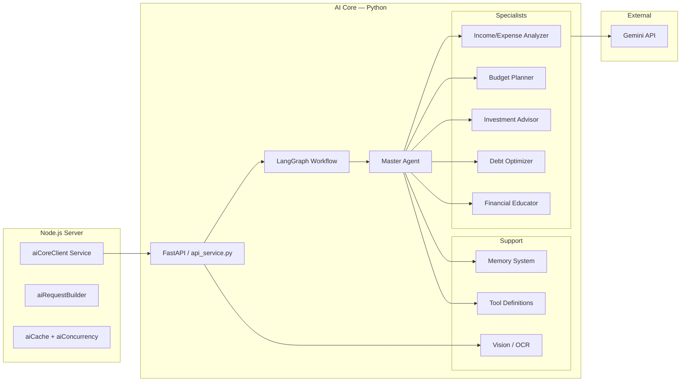

# FinWise — AI Core (Agent System)

> Documentation for the Python-based multi-agent financial intelligence engine.

---

## Overview

The **AI Core** lives in `server/AI_Core/` and provides the intelligent reasoning layer for FinWise. It uses **LangGraph** to orchestrate a directed graph of specialist agents, each powered by **Google Gemini**.

The Node.js server communicates with AI Core via HTTP through the `aiCoreClient` service (`server/src/services/aiCoreClient.ts`).

---

## Architecture



---

## Directory Structure

```
AI_Core/
├── agents/
│   ├── __init__.py
│   ├── master_agent.py              # Orchestrator — routes to specialists
│   ├── income_expense_analyzer.py   # Analyzes income, expenses, trends
│   ├── budget_planner.py            # Creates and optimizes budgets
│   ├── investment_advisor.py        # Portfolio recommendations
│   ├── debt_optimizer.py            # Debt repayment strategies
│   └── financial_educator.py        # Explains financial concepts
├── graph/
│   ├── state.py                     # Pydantic state models (UserProfile, FinancialGoal)
│   └── workflow.py                  # LangGraph workflow builder
├── tools/                           # Tool definitions for agent function-calling
├── memory/                          # Conversation memory management
├── vision/                          # OCR & image analysis pipeline
├── config/
│   └── settings.py                  # Configuration (API keys, model names)
├── contracts/                       # TypeScript-Python shared contracts
├── tests/                           # Pytest test suite
├── api_service.py                   # FastAPI HTTP server (44 KB)
├── main.py                          # CLI entry point for standalone use
├── requirements.txt                 # Python dependencies
└── pyproject.toml                   # Project metadata
```

---

## Agent Descriptions

### Master Agent (`master_agent.py`)

The orchestrator. It:

1. Receives a user query + optional financial profile
2. Classifies the query type using a Gemini-powered **router chain**
3. Delegates to the most appropriate specialist agent
4. Aggregates and formats the final response

### Income/Expense Analyzer (`income_expense_analyzer.py`)

- Analyzes transaction patterns
- Identifies spending trends and anomalies
- Calculates savings rates and cash flow projections

### Budget Planner (`budget_planner.py`)

- Creates category-level budget allocations
- Suggests optimizations based on spending history
- Supports multiple budgeting methodologies (50/30/20, zero-based)

### Investment Advisor (`investment_advisor.py`)

- Recommends portfolio allocations based on risk tolerance
- Analyzes existing investment mix
- Suggests rebalancing strategies

### Debt Optimizer (`debt_optimizer.py`)

- Compares debt repayment strategies (avalanche vs. snowball)
- Calculates payoff timelines and interest savings
- Suggests consolidation opportunities

### Financial Educator (`financial_educator.py`)

- Answers general financial literacy questions
- Explains concepts like compound interest, ETFs, tax brackets
- Provides mini-lessons with examples

---

## Query Routing

The AI Core uses a two-stage routing system:

1. **Router Chain** (Gemini-powered): Classifies queries as `user_specific` or `general`.
   - `user_specific` → Master Agent with full user profile context
   - `general` → Financial Educator (no profile needed)

2. **Master Agent Delegation**: Further routes to the specific specialist based on intent analysis.

If Gemini is unavailable (no API key), the system falls back to **deterministic mode**, treating all queries as `user_specific`.

---

## State Model

The core state is defined as Pydantic models in `graph/state.py`:

```python
class FinancialGoal:
    name: str
    target: float
    timeline_months: int
    priority: int

class UserProfile:
    age: int
    annual_income: float
    monthly_expenses: float
    savings: float
    debts: list[dict]
    financial_goals: list[FinancialGoal]
    risk_tolerance: str       # "conservative" | "moderate" | "aggressive"
    investment_experience: str # "beginner" | "intermediate" | "advanced"
    time_horizon: int         # years
    transactions: list[dict]
```

---

## Vision / OCR Pipeline

Located in `vision/`, this module handles:

- Receipt image processing
- Handwriting recognition
- Data extraction (vendor, amount, date, line items)

The Node.js server uploads images via the `POST /api/ai/handwriting` endpoint, which forwards them to the vision pipeline.

---

## Memory System

Located in `memory/`, this module provides:

- Conversation history storage and retrieval
- Context window management for long-running chat sessions
- Relevant memory recall for improved agent responses

---

## Server Integration

The Node.js server interacts with AI Core through several services:

| Service               | File                              | Purpose                                          |
| --------------------- | --------------------------------- | ------------------------------------------------ |
| `aiCoreClient`        | `services/aiCoreClient.ts`        | HTTP client for AI Core API                      |
| `aiRequestBuilder`    | `services/aiRequestBuilder.ts`    | Constructs structured requests with user context |
| `aiCache`             | `services/aiCache.ts`             | Caches AI responses to reduce latency            |
| `aiConcurrency`       | `services/aiConcurrency.ts`       | Rate-limits concurrent AI requests               |
| `financeIntelligence` | `services/financeIntelligence.ts` | High-level AI feature orchestration              |
| `toolCatalog`         | `services/toolCatalog.ts`         | Registry of tools available to agents            |
| `toolExecutor`        | `services/toolExecutor.ts`        | Executes tool calls from agent responses         |

---

## Running Locally

```bash
cd server/AI_Core
python -m venv .venv
.venv\Scripts\activate          # Windows
pip install -r requirements.txt
python main.py                  # Standalone CLI mode
```

For the HTTP API mode (used by the Node.js server):

```bash
python api_service.py           # Starts FastAPI on port 8000
```

---

## Testing

```bash
cd server/AI_Core
pytest tests/ -v
```

---

_See also_: [ARCHITECTURE.md](./ARCHITECTURE.md) · [API.md](./API.md) · [DATABASE.md](./DATABASE.md)
