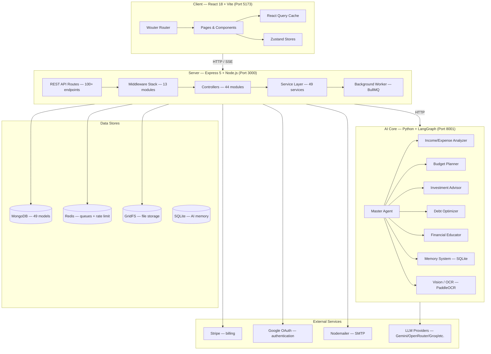
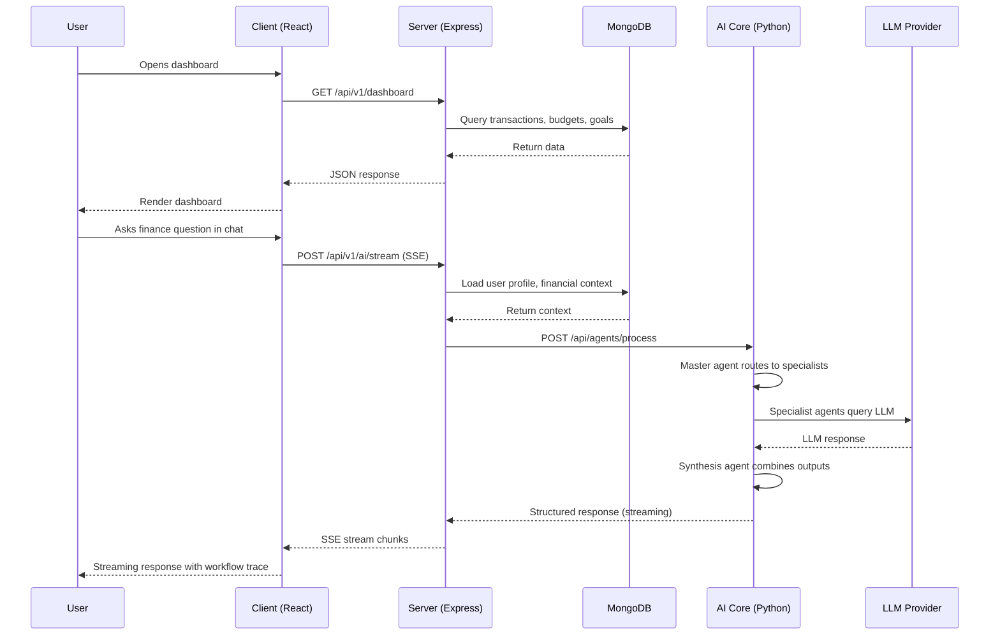

# FinWise — System Architecture

> High-level architecture of the FinWise personal finance platform.

---

## Overview

FinWise is a full-stack, AI-powered personal finance management platform. It is structured as a **monorepo-style** repository with three major subsystems:

| Subsystem   | Language               | Runtime                           | Purpose                                              |
| ----------- | ---------------------- | --------------------------------- | ---------------------------------------------------- |
| **Client**  | TypeScript / React 18  | Vite 7.3 (dev) / static (prod)    | Single-page application (34 pages, PWA support)      |
| **Server**  | TypeScript / Express 5 | Node.js 18+                       | REST API (100+ endpoints), background workers, SSE   |
| **AI Core** | Python 3.11+           | FastAPI / LangGraph               | Multi-agent financial intelligence engine            |

---

## Architecture Diagram



---

## Directory Structure

```
personal-finance/
├── client/                     # React frontend (finwise-client)
│   ├── src/
│   │   ├── components/         # 36+ reusable UI components
│   │   │   ├── ui/             # 47 Radix-based UI primitives
│   │   │   ├── forms/          # Form components
│   │   │   ├── layout/         # Layout components
│   │   │   └── feedback/       # Loading/error feedback
│   │   ├── features/           # Feature modules (chat, journaling, workflows)
│   │   ├── hooks/              # 13 custom React hooks
│   │   ├── lib/                # API client layer + utilities
│   │   │   ├── api/            # 14 domain-specific API modules
│   │   │   └── ...
│   │   ├── pages/              # 34 route-level page components
│   │   ├── stores/             # 6 Zustand state stores
│   │   ├── routes/             # Wouter router definitions
│   │   ├── context/            # Auth context provider
│   │   ├── layouts/            # AppShell, ChatLayout
│   │   ├── types/              # Shared TypeScript types
│   │   ├── services/           # Client-side services
│   │   ├── App.tsx             # Root app with providers + routing
│   │   └── main.tsx            # Vite entry point
│   ├── package.json            # 40 prod + 15 dev dependencies
│   ├── vite.config.ts          # Vite + PWA + Vitest config
│   └── tailwind.config.ts      # Tailwind with dark mode + custom animations
│
├── server/                     # Express backend (finwise-server)
│   ├── AI_Core/                # Python AI agent system
│   │   ├── agents/             # 6 agents (master + 5 specialists)
│   │   ├── graph/              # LangGraph workflow + state
│   │   ├── tools/              # Agent tool definitions
│   │   ├── memory/             # SQLite-based conversation memory
│   │   ├── vision/             # OCR pipeline (PaddleOCR)
│   │   ├── contracts/          # Pydantic response models
│   │   ├── utils/              # LLM wrapper, provider registry, metrics
│   │   ├── tests/              # 15 pytest test files
│   │   ├── api_service.py      # FastAPI HTTP server (1372 lines)
│   │   ├── requirements.txt    # 24 Python dependencies
│   │   └── main.py             # CLI entry point
│   ├── src/
│   │   ├── config/             # 6 config modules (env, DB, Redis, passport, logger, telemetry)
│   │   ├── connectors/         # External service connectors (bank stub)
│   │   ├── controllers/        # 14 root + 30 v1 controllers
│   │   ├── middleware/         # 13 middleware modules
│   │   ├── models/             # 49 Mongoose models
│   │   ├── modules/            # Domain modules (plugins, queue, realtime)
│   │   │   ├── plugins/        # Plugin manager, sandbox, runtime client
│   │   │   ├── realtime/       # Event bus + domain event fanout
│   │   │   └── queue/          # BullMQ job queue
│   │   ├── observability/      # Prometheus metrics
│   │   ├── routes/             # 17 route files
│   │   │   ├── routeRegistry.ts # Central route mounting
│   │   │   ├── v1Routes.ts     # Canonical API v1 routes (917 lines, 80+ endpoints)
│   │   │   └── ...
│   │   ├── schemas/            # 12 root + 23 v1 Zod validation schemas
│   │   ├── services/           # 49 business-logic services
│   │   │   └── tools/          # Tool implementations
│   │   ├── scripts/            # Migration and seed scripts
│   │   ├── test/               # 35 integration test files
│   │   ├── types/              # TypeScript type augmentations
│   │   ├── utils/              # General utilities
│   │   ├── worker/             # BullMQ background worker
│   │   └── server.ts           # Express app bootstrap
│   └── package.json            # 27 prod + 19 dev dependencies
│
├── packages/
│   └── contracts/              # Shared OpenAPI specs & TypeScript contracts
│       ├── openapi/            # OpenAPI path definitions
│       └── typescript/         # Generated TypeScript types
│
├── docs/                       # 33 documentation files
├── research_references/        # Academic and research materials
├── research_survey/            # User research and survey data
├── Minor_Report_personalFinance.pdf  # Academic project report
└── README.md                   # This file
```

---

## Request Lifecycle

### Standard API Request

1. **Client** issues an HTTP request via the React Query / Axios API layer (`lib/api/`).
2. **Express Router** (`routes/`) matches the path and passes through the **middleware stack** (request context, security headers, JSON parsing, cookie parsing, Passport JWT auth, org context, rate limiting, CSRF, Zod validation).
3. **Controller** orchestrates the response — calls one or more **services**.
4. **Services** interact with **MongoDB** (via Mongoose models), **Redis** (caching / BullMQ), or the **AI Core** HTTP API.
5. The response flows back through Express → Client, where React Query caches it for optimistic UI updates.

### AI Request Flow

1. Client sends chat or file-analysis request to `POST /api/v1/ai/command` or `POST /api/v1/ai/stream`.
2. Server's `aiCoreClient` service loads auth, organization, financial context, and any attached files.
3. Request is forwarded to Python AI Core at `PYTHON_API_URL` (default `http://localhost:8001`).
4. AI Core's master agent classifies the query and routes to specialist agents via LangGraph StateGraph.
5. Specialist agents process the request using configured LLM providers (Gemini, OpenRouter, etc.).
6. Master synthesis agent combines specialist outputs into a structured response with action items, workflow trace, and agent details.
7. Response returns through AI Core → Server → Client with streaming support via SSE.

### Realtime Event Flow

1. Server publishes domain events to the event bus (in-memory with TTL).
2. Domain event fanout processes events via MongoDB change streams or polling.
3. Connected clients receive events via SSE at `/api/v1/events/stream`.
4. Client's `useRealtimeEvents` hook invalidates relevant React Query caches.
5. UI updates reactively without manual refetching.

---

## Key Design Decisions

| Decision               | Rationale                                                                           |
| ---------------------- | ----------------------------------------------------------------------------------- |
| **Monorepo-style**     | Shared `.gitignore`, unified development, easy cross-project refactors              |
| **Express 5 + Zod**    | Native async route support; Zod provides compile-time + runtime type safety         |
| **Zustand over Redux** | Minimal boilerplate, first-class TypeScript, easy devtools                          |
| **React Query**        | Declarative caching, background refetching, pagination, and optimistic mutations    |
| **LangGraph for AI**   | Directed graph of agents enables modular, testable, composable financial reasoning  |
| **BullMQ workers**     | Offloads long-running tasks (exports, digests, workflow runs) to a separate process |
| **GridFS**             | Stores receipt images and export files directly in MongoDB                          |
| **Route Registry**     | Central mounting point for canonical `/api/v1` and legacy `/api` paths              |
| **Feature Flags**      | Toggle features per environment (tasks, monetization, CSRF, journal, receipts)      |
| **Organization Scoping** | Multi-tenant data isolation with org context middleware and model plugins         |
| **Circuit Breaker**    | AI Core requests protected with circuit breaker pattern for graceful degradation    |
| **Dual Auth**          | JWT (user sessions) + API keys (programmatic access) with flexible `authAny` middleware |

---

## Data Flow Diagram



---

## Security Architecture

The platform implements defense-in-depth across all layers:

| Layer          | Measures                                                                 |
| -------------- | ------------------------------------------------------------------------ |
| **Transport**  | HTTPS in production, CORS with origin validation, trust proxy detection  |
| **Auth**       | JWT with Passport, Google OAuth2, TOTP 2FA (RFC 6238), API key auth      |
| **Input**      | Zod validation on all endpoints, NoSQL injection sanitization, CSRF      |
| **Access**     | Organization-scoped queries, role-based permissions, plugin sandbox      |
| **Audit**      | 26-type security audit log, 365-day TTL, operational audit events        |
| **Rate Limit** | Global + auth-specific rate limits, per-org/user/API-key/IP tracking     |
| **Headers**    | Helmet with CSP, HSTS, X-Frame-Options, X-Content-Type-Options           |

See [SECURITY.md](./SECURITY.md) for complete details.

---

## Observability

| Tool             | Purpose                                    | Endpoint/Config                |
| ---------------- | ------------------------------------------ | ------------------------------ |
| **Pino**         | Structured JSON logging                    | `server/src/config/logger.ts`  |
| **Prometheus**   | API and AI Core metrics                    | `/api/metrics` (token-gated)   |
| **OpenTelemetry**| Distributed tracing                        | Configurable OTLP endpoint     |
| **Jaeger**       | Trace visualization                        | Local dev setup available      |
| **AI Core Health**| AI service health check                   | `/api/python-health`           |

See [OBSERVABILITY.md](./OBSERVABILITY.md) for monitoring setup and alerting rules.

---

## Deployment Topology

```
┌─────────────────────────────────────────────────┐
│                   Load Balancer                  │
│              (nginx / cloud LB)                  │
└──────────────┬──────────────────┬───────────────┘
               │                  │
    ┌──────────▼──────┐  ┌───────▼──────────┐
    │  Express API     │  │  Express API      │
    │  (Node.js :3000) │  │  (Node.js :3000)  │
    └──────┬───────────┘  └───────┬──────────┘
           │                      │
    ┌──────▼──────────────────────▼───────────┐
    │          MongoDB Replica Set             │
    │          Redis Cluster                   │
    └─────────────────────────────────────────┘
               │
    ┌──────────▼──────────┐
    │   AI Core            │
    │   (Python :8001)     │
    └─────────────────────┘
```

See [DEPLOYMENT.md](./DEPLOYMENT.md) for Docker Compose and production deployment guides.

---

## Module Dependencies

```
client/
  └── depends on server/ (HTTP API via Vite proxy in dev)

server/
  ├── depends on MongoDB (primary datastore)
  ├── depends on Redis (queues, rate limiting)
  ├── depends on AI_Core/ (HTTP API for AI features)
  └── optional: Stripe, Google OAuth, SMTP

server/AI_Core/
  └── depends on LLM providers (Gemini, OpenRouter, etc.)

packages/contracts/
  └── shared by client/ and server/ (OpenAPI types)
```

---

_See also_: [SETUP.md](./SETUP.md) · [API.md](./API.md) · [DATABASE.md](./DATABASE.md) · [AI_CORE.md](./AI_CORE.md) · [FRONTEND.md](./FRONTEND.md) · [MIDDLEWARE.md](./MIDDLEWARE.md) · [SERVICES.md](./SERVICES.md) · [PLUGIN_SYSTEM.md](./PLUGIN_SYSTEM.md) · [DEPLOYMENT.md](./DEPLOYMENT.md) · [CONTRIBUTING.md](./CONTRIBUTING.md)
