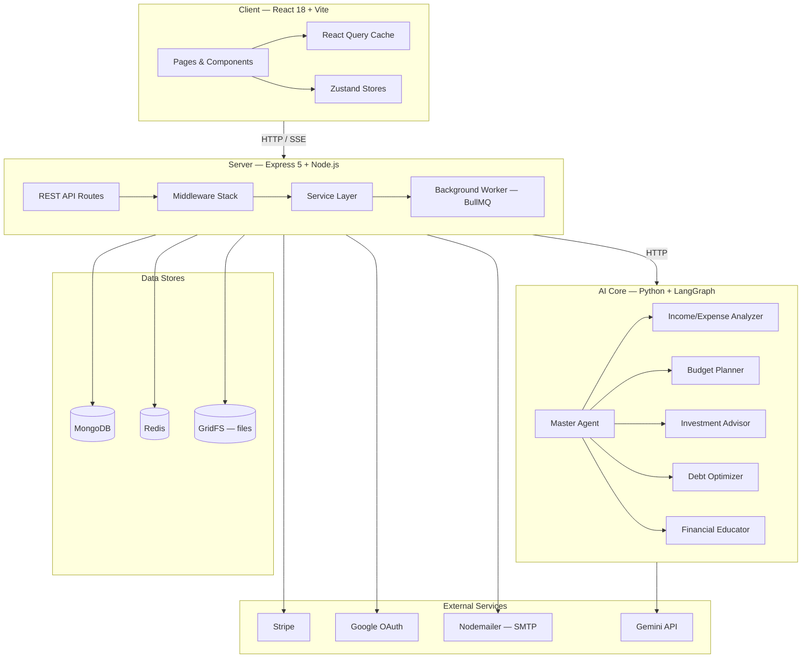

# FinWise — System Architecture

> High-level architecture of the FinWise personal-finance platform.

---

## Overview

FinWise is a full-stack, AI-powered personal finance management platform. It is structured as a **monorepo** with three major subsystems:

| Subsystem   | Language               | Runtime                           | Purpose                                              |
| ----------- | ---------------------- | --------------------------------- | ---------------------------------------------------- |
| **Client**  | TypeScript / React 18  | Vite (dev) / static bundle (prod) | Single-page application (dashboard, chat, workflows) |
| **Server**  | TypeScript / Express 5 | Node.js 18+                       | REST API, background workers, real-time SSE events   |
| **AI Core** | Python 3.11+           | FastAPI / LangGraph               | Multi-agent financial intelligence engine            |

---

## Architecture Diagram



---

## Directory Structure

```
personal-finance/
├── client/                     # React frontend
│   ├── src/
│   │   ├── components/         # Reusable UI components (shadcn/ui based)
│   │   ├── features/           # Feature modules (chat, journaling, workflows)
│   │   ├── hooks/              # Custom React hooks (auth, AI stream, realtime)
│   │   ├── lib/                # API client layer & utilities
│   │   ├── pages/              # Route-level page components (29 pages)
│   │   ├── stores/             # Zustand state stores
│   │   ├── types/              # Shared TypeScript interfaces
│   │   ├── App.tsx             # Root app with routing & providers
│   │   └── main.tsx            # Vite entry point
│   ├── package.json
│   └── vite.config.ts
│
├── server/                     # Express backend
│   ├── AI_Core/                # Python AI agent system
│   │   ├── agents/             # 5 specialist agents + master agent
│   │   ├── graph/              # LangGraph workflow & state
│   │   ├── tools/              # Agent tool definitions
│   │   ├── memory/             # Conversation memory management
│   │   ├── vision/             # OCR & image analysis (receipts)
│   │   └── main.py             # CLI entry point
│   ├── src/
│   │   ├── config/             # Database, env, Redis, passport, telemetry
│   │   ├── controllers/        # 38 route controllers
│   │   ├── middleware/         # 12 middleware modules
│   │   ├── models/             # 44 Mongoose models
│   │   ├── routes/             # 15 route files (70+ REST endpoints)
│   │   ├── schemas/            # Zod validation schemas
│   │   ├── services/           # 42 business-logic services
│   │   ├── scripts/            # Migration & seed scripts
│   │   ├── worker/             # BullMQ background workers
│   │   └── server.ts           # Express app bootstrap
│   └── package.json
│
├── research_references/        # Academic & research materials
├── research_survey/            # User research data
└── README.md
```

---

## Request Lifecycle

1. **Client** issues an HTTP request via the React Query / fetch API layer (`lib/api/`).
2. **Express Router** (`routes/`) matches the path and passes through the **middleware stack** (JWT auth, org context, validation, rate limiting, CSRF).
3. **Controller** orchestrates the response — calls one or more **services**.
4. **Services** interact with **MongoDB** (via Mongoose models), **Redis** (caching / BullMQ), or the **AI Core** HTTP API.
5. For AI requests, the server's `aiCoreClient` service forwards the payload to the **Python AI Core**, which delegates to the appropriate specialist agent via LangGraph, returns a structured response.
6. The response flows back through Express → Client, where React Query caches it for optimistic UI updates.

---

## Key Design Decisions

| Decision               | Rationale                                                                           |
| ---------------------- | ----------------------------------------------------------------------------------- |
| **Monorepo**           | Shared `.gitignore`, unified CI, easy cross-project refactors                       |
| **Express 5 + Zod**    | Async route support out-of-the-box; Zod provides compile-time + runtime type safety |
| **Zustand over Redux** | Minimal boilerplate, first-class TypeScript, easy devtools                          |
| **React Query**        | Declarative caching, background refetching, pagination, and optimistic mutations    |
| **LangGraph for AI**   | Directed graph of agents enables modular, testable, composable financial reasoning  |
| **BullMQ workers**     | Offloads long-running tasks (exports, digests, workflow runs) to a separate process |
| **GridFS**             | Stores receipt images and export files directly in MongoDB                          |

---

_See also_: [SETUP.md](./SETUP.md) · [API.md](./API.md) · [DATABASE.md](./DATABASE.md) · [AI_CORE.md](./AI_CORE.md) · [FRONTEND.md](./FRONTEND.md) · [DEPLOYMENT.md](./DEPLOYMENT.md) · [CONTRIBUTING.md](./CONTRIBUTING.md)
