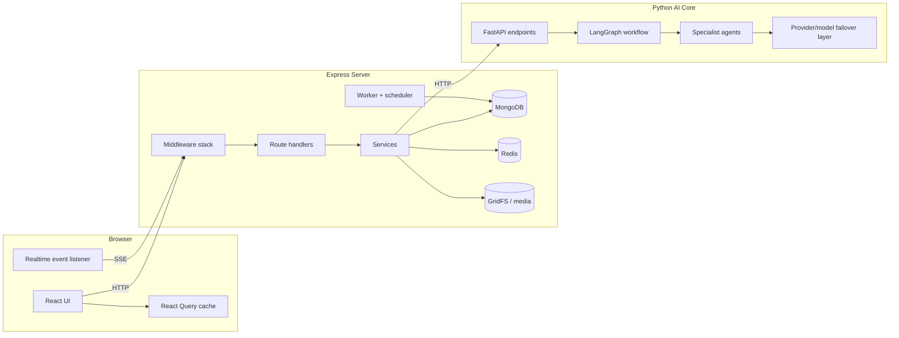
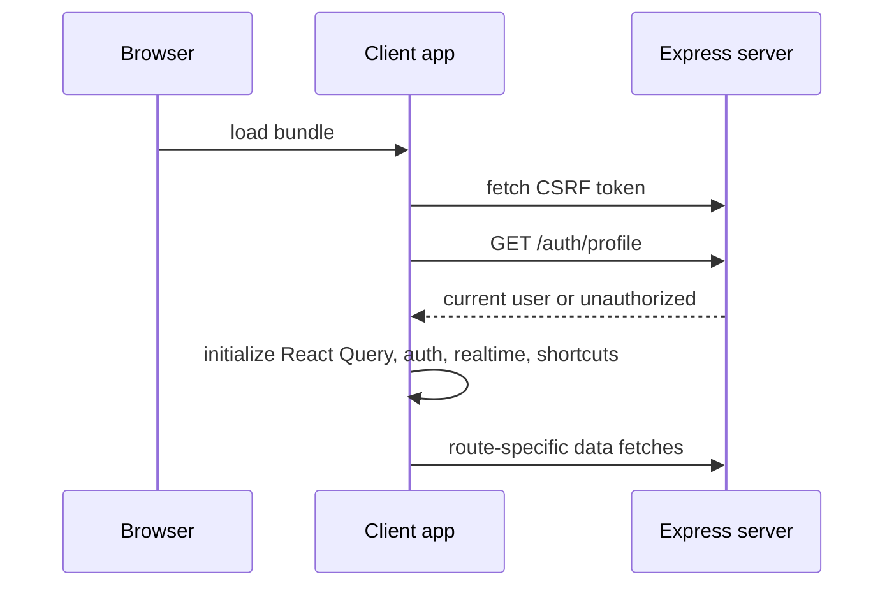
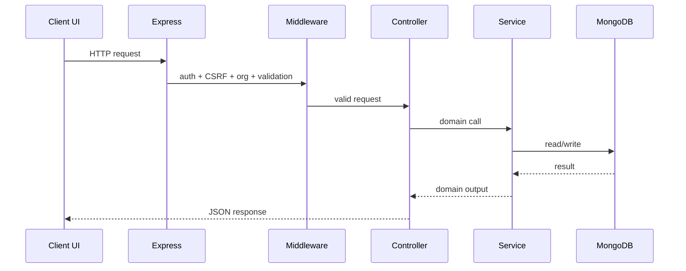
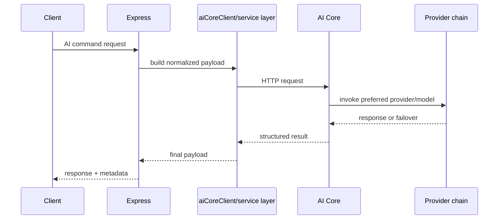
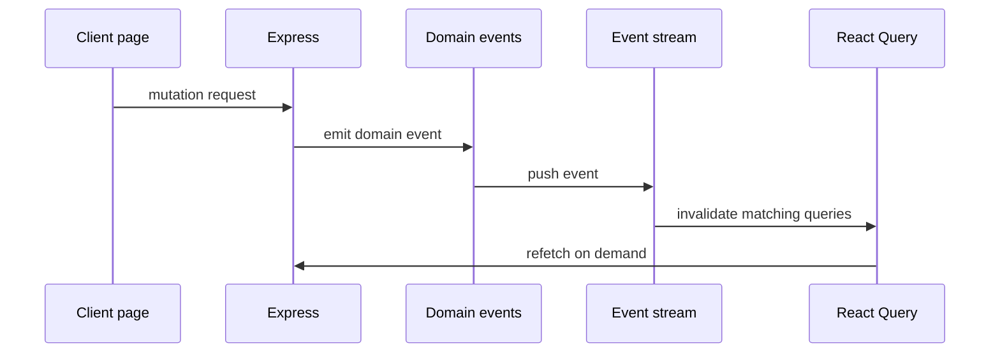

# Complete Project Onboarding Guide

This guide is the "start here" document for engineers who are new to the Personal Finance codebase.

Its goal is simple:

- explain what the product does
- explain how the repository is organized
- explain how the runtime pieces talk to each other
- explain where to make changes for common tasks
- make a new engineer productive after a single careful read

This document does not try to replace every other guide in `docs/`. Instead, it gives you the full mental model and then points you to the focused references when you need more depth.

---

## 1. What this project is

Personal Finance is a full-stack platform for:

- personal finance tracking
- AI-assisted financial guidance
- budgeting, debts, goals, analytics, and exports
- content publishing through blogs and growth stories
- collaboration inside organization-style workspaces
- automation, workflows, and background processing

The repository is a monorepo with three main runtime surfaces:

| Subsystem | Stack | Responsibility |
| --- | --- | --- |
| Client | React 18 + Vite + TypeScript | UI, routing, caching, user interactions |
| Server | Express 5 + TypeScript + MongoDB | Auth, business logic, APIs, SSE, jobs |
| AI Core | FastAPI + Python + LangGraph | Multi-agent reasoning, OCR, provider failover |

---

## 2. Read this document in this order

If you are brand new, read these sections in order:

1. System overview
2. Repository layout
3. Client architecture
4. Server architecture
5. AI Core architecture
6. End-to-end request flows
7. Common engineering tasks

After that, use the focused guides linked at the end for deeper work.

---

## 3. System overview

### 3.1 High-level architecture



### 3.2 Core architectural idea

The project is deliberately split so each layer has a clear job:

- The client is responsible for presentation, route composition, optimistic UX, and local interaction patterns.
- The server is responsible for trust boundaries, validation, persistence, orchestration, and domain events.
- The AI Core is responsible for reasoning, agent routing, OCR, and provider/model failover.

The server is the source of truth for app state.
The client is a cached projection of that state.
The AI Core is a specialized dependency of the server, not a peer visible directly to browser code.

---

## 4. Repository layout

Top-level structure:

```text
personal-finance/
|- client/
|- server/
|  |- AI_Core/
|- packages/
|  |- contracts/
|- docs/
```

### 4.1 `client/`

This is the frontend application.

Current high-value folders in `client/src/`:

| Path | Purpose |
| --- | --- |
| `app/` | app-wide providers and initialization |
| `components/` | reusable UI and feature components |
| `context/` | runtime React contexts such as auth |
| `features/` | feature-oriented UI modules |
| `hooks/` | custom hooks including realtime and keyboard behavior |
| `layouts/` | route layouts such as the main shell and chat layout |
| `lib/` | shared client infrastructure such as API, query client, utils, media helpers |
| `pages/` | route-level screens |
| `routes/` | route definitions, router setup, route guards |
| `services/` | thin service exports that wrap `lib/api*` modules |
| `stores/` | Zustand client-side stores |
| `types/` | client-visible TypeScript types |

### 4.2 `server/`

This is the main API and application layer.

Important folders in `server/src/`:

| Path | Purpose |
| --- | --- |
| `config/` | env loading, logger, DB, passport, platform config |
| `controllers/` | route handlers at the HTTP boundary |
| `middleware/` | auth, CSRF, request context, validation, org context, error handling |
| `models/` | Mongoose models |
| `modules/` | larger domain modules such as plugins |
| `observability/` | metrics and instrumentation |
| `routes/` | route registries and routers |
| `schemas/` | Zod request validation schemas |
| `services/` | business logic and external orchestration |
| `utils/` | shared server helpers |
| `worker/` | async job processing runtime |

### 4.3 `server/AI_Core/`

This is the Python AI service.

Important folders:

| Path | Purpose |
| --- | --- |
| `agents/` | specialist and master agents |
| `config/` | AI settings and environment configuration |
| `contracts/` | request and response models |
| `graph/` | LangGraph workflow definition and state |
| `memory/` | memory extraction and retrieval |
| `tests/` | pytest suite |
| `tools/` | tool definitions for agent workflows |
| `utils/` | provider registry, rate limiting, request metrics, LLM wrapper |
| `vision/` | OCR and handwriting/receipt parsing |

### 4.4 `packages/contracts/`

Shared contracts live here.
This is where cross-runtime schema coordination should land when the client and server need the same language.

### 4.5 `docs/`

This folder contains both focused technical guides and larger reference material.
This onboarding file should be the first document a newcomer reads.

---

## 5. Client architecture

### 5.1 Client bootstrap path

The client starts from:

- `client/src/main.tsx`
- `client/src/App.tsx`
- `client/src/app/providers/AppProviders.tsx`
- `client/src/routes/AppRouter.tsx`

The runtime composition is:

1. Vite loads `main.tsx`
2. `App.tsx` renders `AppProviders`
3. `AppProviders` installs global providers and effects
4. `AppRouter` resolves route definitions and wraps pages in layouts

### 5.2 Provider stack

The provider stack in `AppProviders.tsx` is important because it tells you what global assumptions the app makes:

| Provider / effect | Purpose |
| --- | --- |
| `QueryClientProvider` | server-state caching and mutations |
| `ThemeProvider` | design tokens and dark mode behavior |
| `AuthProvider` | user bootstrap, logout, auth state |
| `useRealtimeEvents()` | keeps cached app state in sync after domain events |
| `useKeyboardShortcuts()` | global shortcuts |
| `TooltipProvider` | UI behavior for tooltips |
| `Toaster` | toast notifications |
| `FeatureLimitDialog` | entitlement/plan gating UI |
| `PlanAndUsageDialog` | usage and billing dialog |

If a new page "needs global access", first ask whether it belongs in one of these layers or whether it should stay local to the page.

### 5.3 Routing model

The current route system is defined in:

- `client/src/routes/routeDefinitions.tsx`
- `client/src/routes/AppRouter.tsx`

The app supports three route shapes:

| Layout | Meaning |
| --- | --- |
| `app` | standard product shell with sidebar and copilot |
| `chat` | focused full-screen chat layout |
| `default` | public or standalone page layout |

And three access levels:

| Access | Meaning |
| --- | --- |
| `protected` | requires authenticated user |
| `public` | visible to anyone |
| `public-only` | redirect authenticated users away |

Key protected routes include:

- `/dashboard`
- `/transactions`
- `/finance`
- `/portfolio`
- `/goals-debts`
- `/analytics`
- `/chat`
- `/workflows`
- `/tasks`
- `/receipts`
- `/blogs`
- `/growth-stories`
- `/settings`

### 5.4 Layout model

The main application shell lives in:

- `client/src/layouts/AppShell.tsx`

It composes:

- `Sidebar`
- page content
- `FinancialCopilot`

This means page components under the app layout should focus on page logic and content, not rebuild global chrome.

### 5.5 Auth and session model

Auth state is managed in:

- `client/src/context/AuthContext.tsx`

Important behavior:

- On boot, the app fetches a CSRF token.
- It then calls `/auth/profile` to determine the current session.
- If a user exists, the ID is cached in `localStorage` for parts of the app that still need it.
- Logout clears both server session state and local user identity.

When debugging "why does the app think I am logged out?" start here.

### 5.6 Data-fetching model

React Query is the default server-state system.

Main file:

- `client/src/lib/queryClient.ts`

Key defaults:

- shared query function built on `apiClient`
- no window-focus refetch by default
- `staleTime` of 30 seconds
- light retry for server failures

This means many screens will look passive until invalidated by:

- explicit mutation side effects
- route changes
- manual refetches
- realtime invalidation from SSE

### 5.7 Realtime model

Realtime sync happens in:

- `client/src/hooks/useRealtimeEvents.ts`

The hook opens an `EventSource` to:

- `/api/v1/events/stream`

It listens for domain events and invalidates matching query keys.

This is a critical bridge between user actions and "dashboard updates automatically".
If a screen looks stale after an action completes, inspect this file before adding ad hoc refetches.

### 5.8 Theming model

Theme behavior is split across:

- `client/src/index.css`
- `client/src/components/ThemeProvider.tsx`

The current visual direction is dark monochrome.

Important implications:

- design tokens live in CSS variables
- new visual work should use semantic tokens like `bg-card`, `text-muted-foreground`, `border-border`
- avoid hardcoding accent colors unless there is a clear product reason

### 5.9 Media model

Media normalization is centralized in:

- `client/src/lib/media.ts`

Rendering is centralized in:

- `client/src/components/LazyImage.tsx`

If a blog image, growth-story cover, avatar, or media ID-backed file does not render correctly, start in those two files.

### 5.10 Page/component organization

The client roughly divides into:

| Layer | What belongs here |
| --- | --- |
| `pages/` | route-level screens |
| `components/` | reusable UI or app widgets |
| `features/` | larger feature clusters that may own multiple components |
| `hooks/` | reusable behavior |
| `stores/` | client-only state not naturally owned by React Query |

Rule of thumb:

- If the code is route-specific, keep it close to the page.
- If two or more pages use it, consider `components/` or `hooks/`.
- If it is server-backed state, prefer React Query over Zustand.
- If it is ephemeral UI state, Zustand or local component state may be appropriate.

### 5.11 Where to change common frontend things

| Goal | Start here |
| --- | --- |
| add a new route/page | `client/src/routes/routeDefinitions.tsx` |
| change app chrome | `client/src/layouts/AppShell.tsx`, `client/src/components/Sidebar.tsx` |
| adjust global caching | `client/src/lib/queryClient.ts` |
| adjust auth bootstrap | `client/src/context/AuthContext.tsx` |
| fix stale dashboard data | `client/src/hooks/useRealtimeEvents.ts` |
| fix content image rendering | `client/src/lib/media.ts`, `client/src/components/LazyImage.tsx` |
| change dashboard experience | `client/src/pages/Dashboard.tsx` and linked widgets |
| change AI status UI | `client/src/components/AiStatusDialog.tsx` |

---

## 6. Server architecture

### 6.1 Server bootstrap path

The main boot files are:

- `server/src/server.ts`
- `server/src/app.ts`

`createApp()` in `app.ts` is the main composition function.
It builds Express once and installs all middleware and routes.

### 6.2 Middleware order matters

The middleware stack in `server/src/app.ts` is part of the system design.

Important stages:

1. CORS
2. Helmet and CSP
3. body parsing
4. NoSQL sanitization
5. cookie parsing
6. passport initialization
7. request context
8. response context
9. deprecation headers
10. logging
11. metrics
12. optional JWT auth
13. org context
14. API rate limiting
15. CSRF protection
16. route mounting
17. not found handler
18. global error handler

If a request is failing "before it reaches the controller", this order is what you inspect.

### 6.3 Route mounting model

Current route mounting is centralized in:

- `server/src/routes/routeRegistry.ts`

There are two route surfaces:

| Surface | Purpose |
| --- | --- |
| `/api/v1/...` | canonical API |
| `/api/...` | legacy compatibility paths |

This matters because new API work should target the canonical `v1` surface unless there is a clear migration requirement.

### 6.4 Major route groups

Route files under `server/src/routes/` include:

- `authRoutes.ts`
- `aiRoutes.ts`
- `chatRoutes.ts`
- `financialDataRoutes.ts`
- `financialJournalRoutes.ts`
- `receiptRoutes.ts`
- `taskRoutes.ts`
- `blogRoutes.ts`
- `growthStoryRoutes.ts`
- `mediaRoutes.ts`
- `configRoutes.ts`
- `publicShareRoutes.ts`
- `monetizationRoutes.ts`
- `v1Routes.ts`

Think of these as HTTP boundaries, not domain owners.
The domain logic usually lives in services.

### 6.5 Canonical `v1` router responsibilities

`server/src/routes/v1Routes.ts` is the largest route surface and contains many core product capabilities:

- organizations and members
- API keys
- usage ledger
- billing
- workflows
- finance accounts, merchants, budgets, recurring rules, forecast
- exports
- tool simulation/execution
- AI endpoints
- autopilot
- notifications
- marketplace and plugins
- integrations
- automation events
- analytics
- comments and activity feed
- 2FA
- audit logs
- connector health

This file is a practical map of "what the product already does".

### 6.6 Controller / service / schema layering

The server generally follows this flow:

1. Route matches request
2. Middleware authenticates and validates
3. Controller parses HTTP context and calls services
4. Service performs domain work
5. Model persists state
6. Controller formats HTTP response

Responsibilities by layer:

| Layer | Responsibility |
| --- | --- |
| Route | URL and middleware binding |
| Schema | request validation |
| Controller | request/response orchestration |
| Service | business logic and integration work |
| Model | persistence |

If business rules are being added directly in a controller, that is usually the wrong layer.

### 6.7 Domain services

The `server/src/services/` folder is the heart of the backend.

Representative services include:

- `aiCoreClient.ts`
- `aiCache.ts`
- `aiConcurrency.ts`
- `aiRequestBuilder.ts`
- `financeIntelligence.ts`
- `transactionService.ts`
- `blogService.ts`
- `growthStoryService.ts`
- `exports.ts`
- `integrations.ts`
- `workflows.ts`
- `workflowScheduler.ts`
- `toolCatalog.ts`
- `toolExecutor.ts`
- `auditService.ts`

When you want to understand "what really happens after the HTTP request", services are usually the right next stop.

### 6.8 Background jobs and worker model

Async work is processed by:

- `server/src/worker/worker.ts`

This worker:

- connects to MongoDB
- claims queued jobs from persistence
- processes workflow runs
- processes integration sync runs
- processes export jobs
- runs a workflow scheduler

This project does not treat long-running work as a fire-and-forget in-process task.
If something is queueable, it belongs in the worker model.

### 6.9 Server-side realtime model

The client subscribes to:

- `GET /api/v1/events/stream`

The server emits domain events that the client uses to invalidate cached queries.

The effect is:

- user mutates state
- server emits relevant event
- client invalidates related data
- pages refresh naturally

This is the preferred freshness loop.

### 6.10 Security model at a glance

Important protections already exist:

- JWT auth via Passport
- optional JWT auth for mixed surfaces
- org context resolution
- CSRF protection on `/api`
- request-size limits
- NoSQL sanitization
- CORS restrictions
- Helmet and CSP
- auth-specific rate limiting
- global API rate limiting

When adding new server endpoints, preserve this model instead of bypassing it for convenience.

### 6.11 Where to change common backend things

| Goal | Start here |
| --- | --- |
| add a new API endpoint | a route file, matching Zod schema, controller, and service |
| add request validation | `server/src/schemas/` |
| change auth/session behavior | `server/src/config/passport.ts`, auth middleware, auth controllers |
| change org resolution | `server/src/middleware/orgContext.ts` |
| change global middleware/security | `server/src/app.ts` |
| add async processing | `server/src/worker/worker.ts` plus relevant service |
| change AI status aggregation | `server/src/controllers/aiStatusController.ts` |
| change blog or growth story backend logic | `blogController.ts` / `growthStoryController.ts` and matching services |

---

## 7. AI Core architecture

### 7.1 AI Core role in the system

The AI Core is a dedicated service, not just a helper library inside the server.

That separation is useful because:

- model/provider concerns stay isolated
- agent routing remains independent of Express concerns
- AI-specific tests stay in Python
- the server can apply its own concurrency, caching, and circuit-breaking around AI calls

### 7.2 Main AI entrypoints

Important files:

- `server/AI_Core/api_service.py`
- `server/AI_Core/main.py`
- `server/AI_Core/graph/workflow.py`
- `server/AI_Core/utils/llm_wrapper.py`
- `server/AI_Core/utils/provider_registry.py`

### 7.3 AI request flow

Typical flow:

1. Express receives an AI-related request
2. server services build a normalized AI payload
3. Express calls AI Core over HTTP
4. FastAPI endpoint accepts the request
5. LangGraph workflow routes work across agents
6. the LLM wrapper selects a provider and model
7. structured response comes back to the server
8. server persists or exposes results to the client

### 7.4 Agent model

The AI Core uses a specialist-agent setup.

Current specialist areas include:

- income and expense analysis
- budget planning
- investment advice
- debt optimization
- financial education

There is also a higher-level orchestration layer that decides how to route or combine specialist work.

### 7.5 Provider and model failover

Provider selection and failover are handled by:

- `server/AI_Core/utils/provider_registry.py`
- `server/AI_Core/utils/llm_wrapper.py`

The AI Core supports multiple providers such as:

- Gemini
- OpenRouter
- Groq
- Grok
- Together
- Mistral

Failover works at two levels:

- multiple model candidates for a provider
- multiple providers in a fallback chain

This is a major reliability feature, and new AI work should preserve it.

### 7.6 AI Core HTTP surfaces

Important endpoints include:

- `GET /health`
- `GET /api/providers`
- AI process endpoints
- OCR / vision endpoints
- what-if scenario endpoints
- streaming endpoints

The Express server uses these endpoints rather than importing AI Core logic directly.

### 7.7 Memory and vision

The AI Core contains:

- `memory/` for memory extraction and retrieval
- `vision/` for receipt parsing and handwriting recognition

These are separate concerns from text-only financial reasoning and should stay modular.

### 7.8 AI Core testing

Run AI Core tests from:

```bash
cd server/AI_Core
pytest
```

Targeted provider tests:

```bash
pytest tests/test_provider_env.py
```

If you change provider logic or fallback behavior, update these tests with the code change.

---

## 8. End-to-end request flows

### 8.1 Browser boot flow



### 8.2 Standard authenticated API flow



### 8.3 AI command flow



### 8.4 Realtime refresh flow



### 8.5 Media rendering flow

1. Page receives image-like field from API
2. Media helper normalizes the value
3. `LazyImage` loads the normalized URL
4. If that fails, it tries fallback media
5. If that still fails, a neutral fallback surface is rendered

This is why image bugs should usually be investigated in the client helper layer and CSP layer before changing content data.

---

## 9. Common product domains

### 9.1 Finance data

Covers:

- transactions
- budgets
- merchants
- recurring rules
- savings, cash flow, goals, debts

Likely places to inspect:

- `financialDataRoutes.ts`
- finance-related `v1Routes.ts` endpoints
- `transactionService.ts`
- finance controllers and models

### 9.2 AI outputs

Covers:

- AI-generated insights
- AI command processing
- scenarios
- financial stories
- AI status

Likely places:

- `server/src/controllers/aiController.ts`
- `server/src/controllers/aiStatusController.ts`
- `server/src/services/aiCoreClient.ts`
- `client/src/components/ActionableInsights.tsx`
- `client/src/components/AiStatusDialog.tsx`

### 9.3 Content

Covers:

- blogs
- growth stories
- shared/public story pages

Likely places:

- `blogRoutes.ts`, `growthStoryRoutes.ts`
- `blogController.ts`, `growthStoryController.ts`
- `blogService.ts`, `growthStoryService.ts`
- content pages in `client/src/pages/`
- media helpers in `client/src/lib/media.ts`

### 9.4 Automation and workflows

Covers:

- workflow templates
- workflow runs
- automation events
- autopilot
- scheduled processing

Likely places:

- `v1Routes.ts`
- workflow controllers and services
- `worker/worker.ts`
- `workflowScheduler.ts`

### 9.5 Collaboration and organizations

Covers:

- organizations
- invites
- comments
- activity feed
- notifications
- audit visibility

Likely places:

- org controllers and services
- collaboration endpoints in `v1Routes.ts`
- `ActivityFeed`, `CommentThread`, `NotificationCenter`

---

## 10. How to add new work safely

### 10.1 Add a new page

Checklist:

1. create the page in `client/src/pages/`
2. add or reuse data hooks / React Query calls
3. add the route in `client/src/routes/routeDefinitions.tsx`
4. choose the correct layout
5. add sidebar navigation if needed
6. reuse semantic theme tokens
7. make sure realtime invalidation is covered if the page depends on live updates

### 10.2 Add a new API endpoint

Checklist:

1. choose the correct route file
2. add a Zod schema under `server/src/schemas/`
3. add a controller method
4. put business logic in a service
5. reuse existing models where appropriate
6. return consistent response shapes
7. add tests if behavior is non-trivial

### 10.3 Add new AI behavior

Checklist:

1. decide whether the change belongs in Express orchestration or AI Core logic
2. if provider/model behavior changes, update `provider_registry.py` and `llm_wrapper.py`
3. if UI visibility changes, update `AiStatusDialog.tsx`
4. if request/response shape changes, update server controller/types and client consumers
5. add or update pytest coverage

### 10.4 Fix a stale-data bug

Checklist:

1. identify which query key is stale
2. inspect mutation success handlers
3. inspect `useRealtimeEvents.ts`
4. inspect whether the server emits the right domain event
5. only add manual refetch calls if the shared invalidation model is not the right place

### 10.5 Fix a media bug

Checklist:

1. inspect the raw value coming from the API
2. inspect `resolveMediaUrl` and related helpers
3. inspect `LazyImage`
4. inspect `server/src/app.ts` CSP `imgSrc`
5. verify whether the underlying media route requires auth

---

## 11. Local development workflow

### 11.1 Recommended start order

1. MongoDB
2. Redis
3. Express server
4. worker
5. AI Core
6. client

### 11.2 Daily commands

Client:

```bash
cd client
npm install
npm run dev
```

Client validation:

```bash
npm run build
```

Server:

```bash
cd server
npm install
npm run dev
```

Server validation:

```bash
npm run check
```

Worker:

```bash
cd server
npm run worker:dev
```

AI Core:

```bash
cd server/AI_Core
python -m venv .venv
.venv\Scripts\activate
pip install -r requirements.txt
python api_service.py
```

AI Core validation:

```bash
pytest tests/test_provider_env.py
```

### 11.3 Good local habits

- run the client and server together when changing UI backed by APIs
- run AI Core locally when touching AI, OCR, or status surfaces
- keep the worker running when testing exports, integrations, workflows, or scheduled jobs
- prefer targeted validation after each logical change, then broader checks before merging

---

## 12. Debugging guide

### 12.1 If the page loads but data is missing

Check:

- auth bootstrap in `AuthContext.tsx`
- React Query key and query function
- API response in network tools
- route guard behavior
- org context requirements on the backend

### 12.2 If mutations work but UI does not refresh

Check:

- mutation cache updates
- `useRealtimeEvents.ts`
- server domain event emission
- query key mismatch

### 12.3 If AI endpoints fail

Check:

- Express `PYTHON_API_URL`
- AI Core process availability
- `/health`
- `/api/providers`
- AI status dialog
- provider API keys
- provider-chain tests

### 12.4 If auth fails

Check:

- CSRF token fetch
- `/auth/profile`
- cookies and credentials mode
- passport/JWT config
- rate limiters on auth endpoints

### 12.5 If images do not render

Check:

- normalized media URL
- browser console/network
- CSP `imgSrc`
- whether the route is external, relative, or media-id based

### 12.6 If background tasks never finish

Check:

- worker process is running
- relevant job is being queued with status `queued`
- worker concurrency and polling interval
- service-level processing logs

---

## 13. Suggested reading order after this guide

Once you finish this file, read:

1. `docs/SETUP.md`
2. `docs/ARCHITECTURE.md`
3. `docs/FRONTEND.md`
4. `docs/AI_CORE.md`
5. `docs/AI_PROVIDERS_AND_FAILOVER.md`
6. `docs/DASHBOARD_AND_THEME.md`
7. `docs/API.md`
8. `docs/DATABASE.md`

If your work is mostly product UI:

- `FRONTEND.md`
- `DASHBOARD_AND_THEME.md`
- `API.md`

If your work is mostly backend/domain:

- `ARCHITECTURE.md`
- `API.md`
- `DATABASE.md`
- `SERVICES.md`

If your work is mostly AI:

- `AI_CORE.md`
- `AI_PROVIDERS_AND_FAILOVER.md`
- relevant Python tests

---

## 14. Glossary

| Term | Meaning in this codebase |
| --- | --- |
| App shell | main authenticated layout with sidebar and copilot |
| AI Core | Python service that handles agent orchestration and LLM access |
| App route | client route definition with layout and access metadata |
| Domain event | server-side event used to drive realtime updates |
| Protected route | client route that requires an authenticated user |
| Public-only route | route like login/register that should not be shown to signed-in users |
| Org context | currently active organization/workspace on the server |
| Autopilot | AI-assisted plan/simulate/approve/execute workflow flow |
| Query invalidation | React Query mechanism used to refresh stale cached data |
| Provider chain | ordered list of LLM providers the AI Core can fail over through |

---

## 15. Quick file index for new engineers

If you only remember one table from this document, make it this one.

| Task | File to open first |
| --- | --- |
| understand client startup | `client/src/App.tsx` |
| understand global providers | `client/src/app/providers/AppProviders.tsx` |
| understand routing | `client/src/routes/AppRouter.tsx` and `routeDefinitions.tsx` |
| understand auth on client | `client/src/context/AuthContext.tsx` |
| understand query behavior | `client/src/lib/queryClient.ts` |
| understand dashboard | `client/src/pages/Dashboard.tsx` |
| understand realtime refresh | `client/src/hooks/useRealtimeEvents.ts` |
| understand image/media rendering | `client/src/lib/media.ts` and `client/src/components/LazyImage.tsx` |
| understand server boot | `server/src/app.ts` |
| understand route mounting | `server/src/routes/routeRegistry.ts` |
| understand major backend features | `server/src/routes/v1Routes.ts` |
| understand AI server bridge | `server/src/controllers/aiStatusController.ts` and `server/src/services/aiCoreClient.ts` |
| understand worker processing | `server/src/worker/worker.ts` |
| understand AI provider failover | `server/AI_Core/utils/provider_registry.py` and `server/AI_Core/utils/llm_wrapper.py` |
| understand AI HTTP service | `server/AI_Core/api_service.py` |

---

## 16. Final advice for new contributors

Do not try to understand every file before making your first change.
Understand the flow for the feature you are touching:

- route
- data source
- controller/service
- UI consumer
- invalidation or side effect

This codebase is large, but it is navigable once you anchor yourself in that flow.

When in doubt:

- start from the visible page or endpoint
- follow it inward one layer at a time
- keep HTTP, service, and UI concerns separate
- preserve the shared patterns instead of building one-off shortcuts
