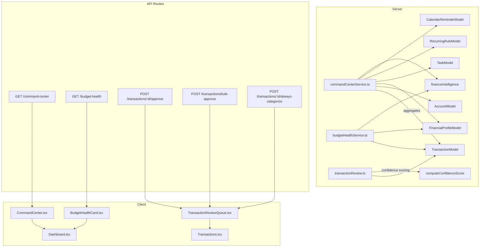

# FinWise Improvement Plan — Phase 1 Walkthrough

## Overview

This implementation transforms the FinWise dashboard from a passive financial summary into an **active Financial Command Center** — a daily-use decision cockpit that aggregates signals, scores financial health, and enables one-click transaction review workflows.

---

## Architecture

---

## New Files Created

### Server

#### [commandCenterService.ts](file:///c:/Users/RAVIPRAKASH/personal-finance/server/src/services/commandCenterService.ts)
The primary data aggregator for the dashboard. Computes:
- **Cash Runway**: Liquid balance ÷ avg daily expense = days remaining
- **Budget Burn Rate**: Actual vs planned with EOM projection
- **Upcoming Bills**: Calendar reminders + recurring rules in next 7 days
- **Risky Subscriptions**: Recurring charges with low confidence (< 0.6)
- **Debt Pressure**: Total minimums vs income ratio
- **Pending Tasks**: Open/due-soon/overdue counts
- **Goals Snapshot**: On-track vs at-risk with overall progress
- **Priority Signals**: Ranked by `act_now` > `review_this_week` > `safe_to_ignore`

#### [budgetHealthService.ts](file:///c:/Users/RAVIPRAKASH/personal-finance/server/src/services/budgetHealthService.ts)
Weekly financial health score (0–100) composed of:
| Component | Max Points | Logic |
|-----------|-----------|-------|
| Budget Adherence | 40 | Deviation from expected burn rate |
| Review Cleanliness | 20 | Ratio of clean vs flagged transactions |
| Goal Progress | 20 | Weighted progress across all goals |
| Debt Management | 20 | Debt-to-income ratio penalty |

Plus burn-rate alerts per category with "if you continue at this pace" projections.

### Client

#### [CommandCenter.tsx](file:///c:/Users/RAVIPRAKASH/personal-finance/client/src/components/CommandCenter.tsx)
Dashboard hero component with:
- Time-of-day adaptive greeting (morning/afternoon/evening)
- 4 KPI cards: Cash Runway, Budget Burn (with circular gauge), Tasks, Goals
- Priority signal chips color-coded by urgency
- Upcoming bills mini-list
- Framer Motion stagger animations

#### [BudgetHealthCard.tsx](file:///c:/Users/RAVIPRAKASH/personal-finance/client/src/components/BudgetHealthCard.tsx)
- Animated circular health gauge (SVG + Framer Motion)
- Score breakdown bars (budget adherence, review cleanliness, goal progress, debt management)
- Spending trend indicator (improving/stable/worsening)
- "If you continue" projection text
- Burn rate alert chips (warning/critical severity)

#### [TransactionReviewQueue.tsx](file:///c:/Users/RAVIPRAKASH/personal-finance/client/src/components/TransactionReviewQueue.tsx)
- Flag filter chips (uncategorized, duplicate, merchant, split, recurring)
- Confidence score badges (red < 40%, amber 40-70%, green > 70%)
- One-click approve with slide-out animation
- "Always categorize like this" button (creates CategoryRule + approves)
- Bulk select + bulk approve toolbar (max 200)
- Empty state celebration when queue is cleared

---

## Modified Files

### Server

#### [transactionModel.ts](file:///c:/Users/RAVIPRAKASH/personal-finance/server/src/models/transactionModel.ts)
Added to `review` sub-document:
- `confidence_score` (Number, 0.0–1.0) — AI categorization confidence
- `reviewed_at` (Date) — when transaction was approved
- `reviewed_by` (String) — user ID who approved

#### [transactionReview.ts](file:///c:/Users/RAVIPRAKASH/personal-finance/server/src/services/transactionReview.ts)
- Added `computeConfidenceScore()` — heuristic scoring: `1.0 - (0.20 × flag_count) + (0.10 if merchant)`, floor 0.10
- Added `confidence_score` to `TransactionReviewState`
- Added `approveTransaction()` — clears all flags, sets confidence 1.0, records reviewer
- Added `bulkApproveTransactions()` — batch version with ObjectId validation

#### [financialDataController.ts](file:///c:/Users/RAVIPRAKASH/personal-finance/server/src/controllers/financialDataController.ts)
Added 5 new endpoints:
- `getCommandCenter` — serves aggregated command center payload
- `getBudgetHealth` — serves health score + burn rate alerts
- `approveTransactionEndpoint` — single transaction approve
- `bulkApproveEndpoint` — batch approve (max 200)
- `alwaysCategorizeEndpoint` — creates CategoryRule + approves transaction

#### [financialDataRoutes.ts](file:///c:/Users/RAVIPRAKASH/personal-finance/server/src/routes/financialDataRoutes.ts)
Registered 5 new routes under JWT auth.

### Client

#### [transactions.ts (API)](file:///c:/Users/RAVIPRAKASH/personal-finance/client/src/lib/api/transactions.ts)
Added TypeScript types and API client functions for all new endpoints.

#### [Dashboard.tsx](file:///c:/Users/RAVIPRAKASH/personal-finance/client/src/pages/Dashboard.tsx)
Added Command Center and Budget Health sections after the hero.

#### [Transactions.tsx](file:///c:/Users/RAVIPRAKASH/personal-finance/client/src/pages/Transactions.tsx)
Added Tabs with "Ledger" (existing) and "Review Queue" (new TransactionReviewQueue) tabs. URL deep-link via `?tab=review`.

---

## Verification

| Check | Result |
|-------|--------|
| Server `tsc --noEmit` | ✅ 0 errors |
| Client `tsc --noEmit` | ✅ 0 errors in new/modified files |
| Pre-existing errors | `routeGuards.tsx` (unrelated, pre-existing) |

---

## Key Design Decisions

1. **Heuristic Confidence Scoring** — Uses a weighted inverse of flag count rather than ML. Each flag costs 0.20 points, merchant match boosts 0.10. Simple, explainable, and extensible for Phase 2.

2. **"Always Categorize"** — Creates a `CategoryRule` with `matchType: "exact"` on the transaction description. Future imports will auto-categorize matching transactions.

3. **Priority Signal Ranking** — Uses `act_now` > `review_this_week` > `safe_to_ignore` priority levels. Signals are generated from budget burns, debt pressure, review queue depth, and task overdue status.

4. **Data Aggregation vs New Tables** — Command Center composes existing data via aggregation pipelines, avoiding schema bloat. All data is computed at request time with a 2–5 minute React Query stale window.
